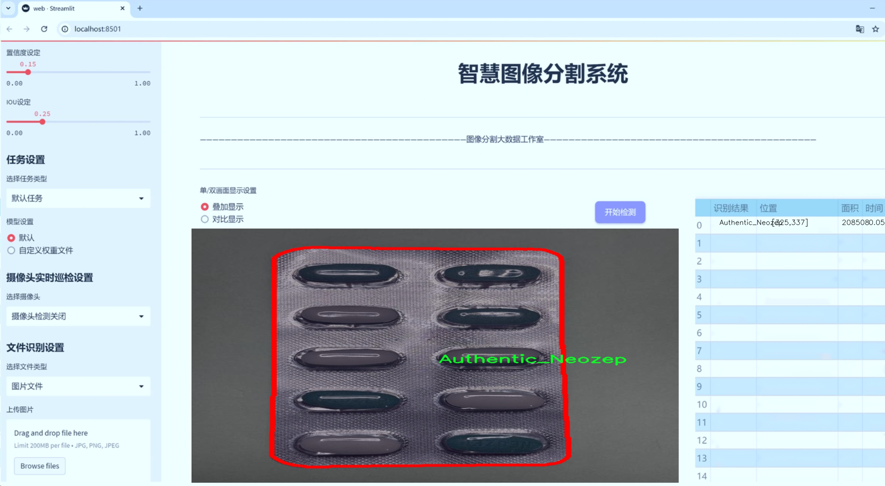
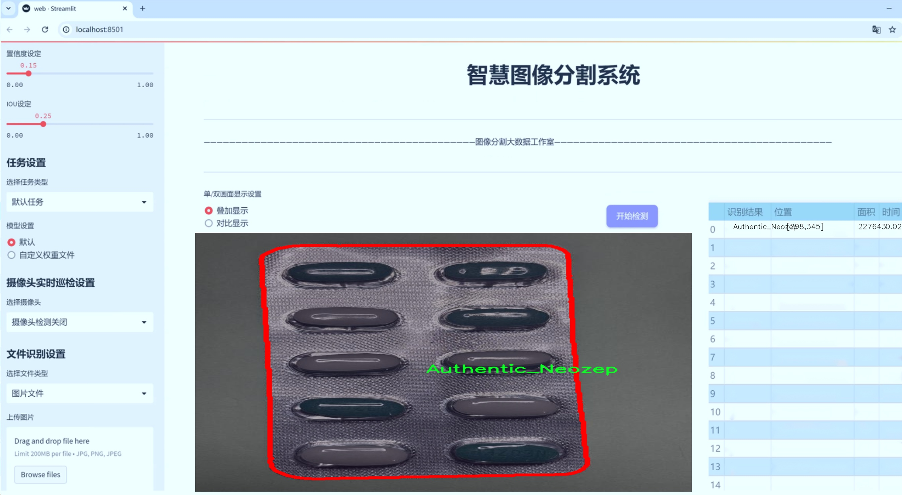
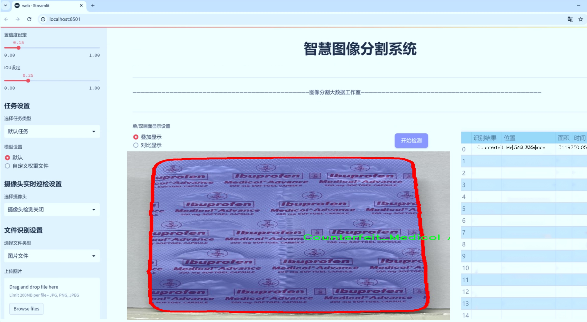
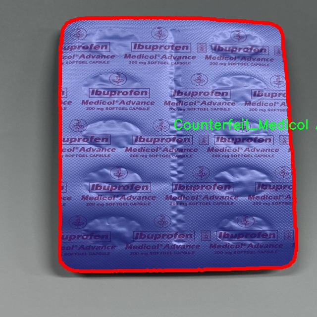
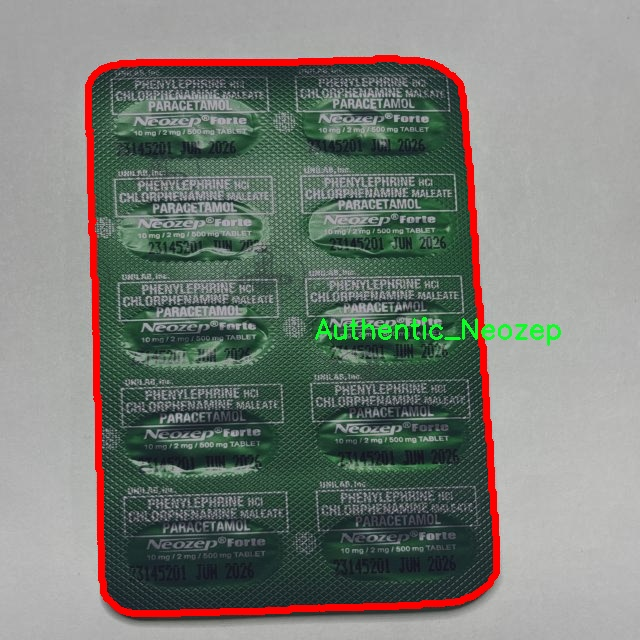
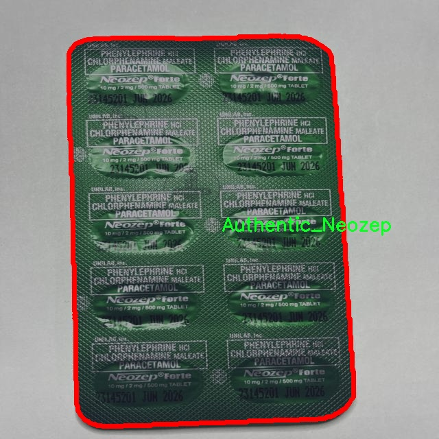
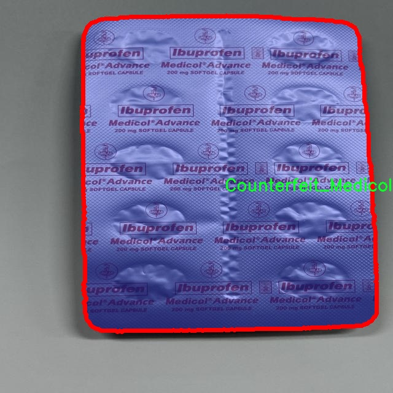
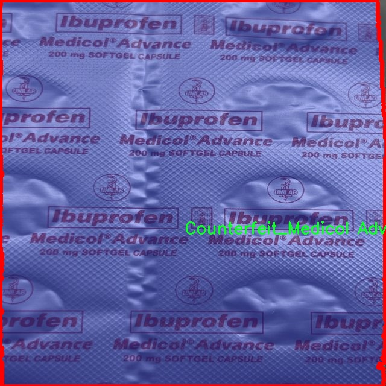

# 药品真伪图像分割系统源码＆数据集分享
 [yolov8-seg-C2f-RFCAConv＆yolov8-seg-C2f-Faster-EMA等50+全套改进创新点发刊_一键训练教程_Web前端展示]

### 1.研究背景与意义

项目参考[ILSVRC ImageNet Large Scale Visual Recognition Challenge](https://gitee.com/YOLOv8_YOLOv11_Segmentation_Studio/projects)

项目来源[AAAI Global Al lnnovation Contest](https://kdocs.cn/l/cszuIiCKVNis)

研究背景与意义

随着全球医药市场的迅速发展，药品的真伪问题日益凸显，尤其是在网络购物和跨境电商盛行的今天，假药的泛滥不仅对患者的健康构成了严重威胁，也对公共卫生安全造成了不可忽视的影响。根据世界卫生组织的统计，全球每年有数十万人因服用假药而导致健康问题甚至死亡。因此，开发一种高效、准确的药品真伪检测系统显得尤为重要。在这一背景下，基于改进YOLOv8的药品真伪图像分割系统应运而生，旨在通过先进的计算机视觉技术，提高药品真伪识别的准确性和效率。

YOLO（You Only Look Once）系列模型因其高效的实时目标检测能力而广泛应用于各类图像处理任务。YOLOv8作为该系列的最新版本，进一步提升了检测精度和速度，尤其在处理复杂背景和多类别目标时表现出色。通过对YOLOv8模型的改进，我们可以更好地适应药品真伪检测的需求，尤其是在多种药品类别和不同伪造手段的情况下，确保系统能够快速、准确地识别和分割出真实药品与假药的图像特征。

本研究所使用的数据集“FINAL_AIMedisina_Merge”包含2000张图像，涵盖11个类别，包括多种真实药品和伪造药品。这一数据集的多样性和丰富性为模型的训练和验证提供了坚实的基础。通过对这些图像进行实例分割，我们不仅能够识别药品的真伪，还能提取出药品包装上的关键信息，如药品名称、生产厂家和有效期等。这些信息对于消费者的购买决策和药品的追溯管理具有重要意义。

此外，药品真伪检测系统的研发还具有广泛的社会意义。通过提高药品真伪识别的准确性，可以有效减少假药的流通，保护消费者的健康权益，增强公众对药品市场的信任。同时，该系统的推广应用将促进药品监管部门的工作效率，帮助他们更好地打击假药犯罪，维护药品市场的秩序。

综上所述，基于改进YOLOv8的药品真伪图像分割系统不仅在技术上具有创新性和实用性，而且在社会层面上具有重要的现实意义。通过这一研究，我们希望能够为药品真伪检测提供一种高效、可靠的解决方案，为构建一个更加安全的药品市场贡献力量。

### 2.图片演示







##### 注意：由于此博客编辑较早，上面“2.图片演示”和“3.视频演示”展示的系统图片或者视频可能为老版本，新版本在老版本的基础上升级如下：（实际效果以升级的新版本为准）

  （1）适配了YOLOV8的“目标检测”模型和“实例分割”模型，通过加载相应的权重（.pt）文件即可自适应加载模型。

  （2）支持“图片识别”、“视频识别”、“摄像头实时识别”三种识别模式。

  （3）支持“图片识别”、“视频识别”、“摄像头实时识别”三种识别结果保存导出，解决手动导出（容易卡顿出现爆内存）存在的问题，识别完自动保存结果并导出到tempDir中。

  （4）支持Web前端系统中的标题、背景图等自定义修改，后面提供修改教程。

  另外本项目提供训练的数据集和训练教程,暂不提供权重文件（best.pt）,需要您按照教程进行训练后实现图片演示和Web前端界面演示的效果。

### 3.视频演示

[3.1 视频演示](https://www.bilibili.com/video/BV127yqYwENW/)

### 4.数据集信息展示

##### 4.1 本项目数据集详细数据（类别数＆类别名）

nc: 11
names: ['Authentic_Alaxan FR', 'Authentic_Bioflu', 'Authentic_Decolgen Forte', 'Authentic_Medicol Advance', 'Authentic_Neozep', 'Counterfefit_Neozep', 'Counterfeit_Alaxan', 'Counterfeit_Bioflu', 'Counterfeit_Biogesic', 'Counterfeit_Decolgen Forte', 'Counterfeit_Medicol Advance']


##### 4.2 本项目数据集信息介绍

数据集信息展示

在药品真伪检测领域，图像分割技术的应用正日益受到重视。为此，我们构建了一个名为“FINAL_AIMedisina_Merge”的数据集，旨在为改进YOLOv8-seg的药品真伪图像分割系统提供强有力的支持。该数据集专注于药品的真伪识别，涵盖了11个类别，分别包括多种正品和伪造药品。这些类别的详细列表为：Authentic_Alaxan FR、Authentic_Bioflu、Authentic_Decolgen Forte、Authentic_Medicol Advance、Authentic_Neozep、Counterfeit_Neozep、Counterfeit_Alaxan、Counterfeit_Bioflu、Counterfeit_Biogesic、Counterfeit_Decolgen Forte和Counterfeit_Medicol Advance。

数据集中的每个类别均代表了一种特定的药品，无论是正品还是伪造品。正品类别如Authentic_Alaxan FR和Authentic_Bioflu等，展示了这些药品在市场上的真实形态，提供了丰富的视觉特征和纹理信息，以帮助模型学习如何识别这些药品的真实外观。与此同时，伪造药品类别如Counterfeit_Neozep和Counterfeit_Bioflu则展示了市场上常见的伪造品特征，包括包装设计的细微差异、字体的变化以及颜色的偏差等。这些信息对于训练模型以准确分辨真伪药品至关重要。

“FINAL_AIMedisina_Merge”数据集不仅涵盖了多种药品的图像，还考虑到了不同拍摄条件下的图像多样性，包括不同的光照、角度和背景。这种多样性使得模型在训练过程中能够学习到更为广泛的特征，从而提高其在实际应用中的鲁棒性和准确性。此外，数据集中还包含了标注信息，确保每张图像的真实标签清晰可辨，为模型的训练提供了可靠的基础。

在药品真伪检测的背景下，准确性和效率是评估模型性能的关键指标。通过使用“FINAL_AIMedisina_Merge”数据集，研究人员和开发者能够利用YOLOv8-seg的先进图像分割能力，快速识别和分割出药品图像中的关键特征。这不仅有助于提高药品真伪检测的准确性，还能在一定程度上降低误判率，从而为消费者提供更安全的用药保障。

随着全球对药品安全问题的关注不断加深，药品真伪检测的需求日益增长。“FINAL_AIMedisina_Merge”数据集的构建正是响应这一需求的重要一步。通过提供一个高质量、标注清晰且多样化的数据集，我们希望能够推动药品真伪检测技术的发展，促进相关研究的深入，为未来的药品安全提供更为坚实的技术支持。











### 5.全套项目环境部署视频教程（零基础手把手教学）

[5.1 环境部署教程链接（零基础手把手教学）](https://www.bilibili.com/video/BV1jG4Ve4E9t/?vd_source=bc9aec86d164b67a7004b996143742dc)


[5.2 安装Python虚拟环境创建和依赖库安装视频教程链接（零基础手把手教学）](https://www.bilibili.com/video/BV1nA4VeYEze/?vd_source=bc9aec86d164b67a7004b996143742dc)

### 6.手把手YOLOV8-seg训练视频教程（零基础小白有手就能学会）

[6.1 手把手YOLOV8-seg训练视频教程（零基础小白有手就能学会）](https://www.bilibili.com/video/BV1cA4VeYETe/?vd_source=bc9aec86d164b67a7004b996143742dc)


按照上面的训练视频教程链接加载项目提供的数据集，运行train.py即可开始训练



     Epoch   gpu_mem       box       obj       cls    labels  img_size
     1/200     0G   0.01576   0.01955  0.007536        22      1280: 100%|██████████| 849/849 [14:42<00:00,  1.04s/it]
               Class     Images     Labels          P          R     mAP@.5 mAP@.5:.95: 100%|██████████| 213/213 [01:14<00:00,  2.87it/s]
                 all       3395      17314      0.994      0.957      0.0957      0.0843

     Epoch   gpu_mem       box       obj       cls    labels  img_size
     2/200     0G   0.01578   0.01923  0.007006        22      1280: 100%|██████████| 849/849 [14:44<00:00,  1.04s/it]
               Class     Images     Labels          P          R     mAP@.5 mAP@.5:.95: 100%|██████████| 213/213 [01:12<00:00,  2.95it/s]
                 all       3395      17314      0.996      0.956      0.0957      0.0845

     Epoch   gpu_mem       box       obj       cls    labels  img_size
     3/200     0G   0.01561    0.0191  0.006895        27      1280: 100%|██████████| 849/849 [10:56<00:00,  1.29it/s]
               Class     Images     Labels          P          R     mAP@.5 mAP@.5:.95: 100%|███████   | 187/213 [00:52<00:00,  4.04it/s]
                 all       3395      17314      0.996      0.957      0.0957      0.0845


### 7.50+种全套YOLOV8-seg创新点代码加载调参视频教程（一键加载写好的改进模型的配置文件）

[7.1 50+种全套YOLOV8-seg创新点代码加载调参视频教程（一键加载写好的改进模型的配置文件）](https://www.bilibili.com/video/BV1Hw4VePEXv/?vd_source=bc9aec86d164b67a7004b996143742dc)

### 8.YOLOV8-seg图像分割算法原理

原始YOLOv8-seg算法原理

YOLOv8-seg算法是Ultralytics公司在2023年推出的最新版本，代表了YOLO系列目标检测和图像分割技术的又一次重大飞跃。该算法不仅继承了前几代YOLO模型的设计理念，还在此基础上进行了多项创新和优化，旨在提高目标检测的精度和速度，同时增强模型的灵活性和适应性。YOLOv8-seg在多个方面进行了改进，特别是在网络结构、数据处理和损失函数设计等方面，展现出其独特的优势。

首先，YOLOv8-seg在输入图像的处理上采用了自适应缩放技术。传统的目标检测算法通常要求输入图像具有固定的尺寸，而YOLOv8-seg则通过将图像的长边缩放到指定尺寸，然后对短边进行填充，从而最大限度地减少信息冗余。这种方法不仅提高了模型的推理速度，还能更好地适应不同长宽比的图像，提升了目标检测的灵活性。此外，在训练阶段，YOLOv8-seg引入了Mosaic增强技术，通过将四张不同的图像随机拼接成一张新图像，迫使模型学习不同位置和背景下的目标特征，从而有效提高了模型的泛化能力和预测精度。

在网络结构方面，YOLOv8-seg对主干网络进行了重要的改进。它采用了C2F模块替代了YOLOv5中的C3模块，C2F模块通过并行更多的梯度流分支，丰富了特征提取的深度和广度。这种设计不仅保证了模型的轻量化，还提升了模型的检测精度和实时性。同时，YOLOv8-seg依然保持了跨级结构（CSP）的思想，利用特征金字塔网络（FPN）和路径聚合网络（PAN）来充分融合多尺度信息，确保在不同尺度下的目标均能被有效检测。

YOLOv8-seg的Neck部分同样进行了优化，去除了YOLOv5中多余的卷积层，直接对不同阶段输出的特征进行上采样。这种简化的结构不仅降低了计算复杂度，还提高了特征融合的效率。在Head部分，YOLOv8-seg引入了解耦头（Decoupled Head）结构，将分类和定位任务分开处理。通过两个独立的卷积分支，YOLOv8-seg能够更精准地进行类别预测和边界框回归，显著提升了检测的准确性。

值得注意的是，YOLOv8-seg在标签分配策略上也进行了创新。与以往的锚框（Anchor-based）方法不同，YOLOv8-seg采用了无锚框（Anchor-free）的方法，将目标检测转化为关键点检测。这一转变使得模型在处理不同大小和形状的目标时更加灵活，减少了对预设锚框的依赖，降低了计算复杂度。通过动态标签分配策略，YOLOv8-seg能够更有效地匹配正负样本，从而提升了训练的效率和效果。

在损失函数的设计上，YOLOv8-seg引入了新的损失策略，包括Varifocal Loss（VFL）和CIoU Loss等。这些损失函数通过对正负样本进行不对称加权，使得模型在训练过程中能够更专注于高质量的正样本，从而提升了检测的精度和召回率。特别是VFL的设计，通过对负样本的衰减处理，降低了负样本对损失的整体贡献，使得模型在处理复杂场景时更加稳定。

综上所述，YOLOv8-seg算法在多个方面进行了深度优化，展现出其在目标检测和图像分割任务中的强大能力。通过自适应图像处理、改进的网络结构、灵活的标签分配策略以及创新的损失函数设计，YOLOv8-seg不仅提升了检测精度和速度，还增强了模型的适应性和泛化能力。这些特性使得YOLOv8-seg成为当前最先进的目标检测算法之一，广泛应用于各类计算机视觉任务中。


### 9.系统功能展示（检测对象为举例，实际内容以本项目数据集为准）

图9.1.系统支持检测结果表格显示

  图9.2.系统支持置信度和IOU阈值手动调节

  图9.3.系统支持自定义加载权重文件best.pt(需要你通过步骤5中训练获得)

  图9.4.系统支持摄像头实时识别

  图9.5.系统支持图片识别

  图9.6.系统支持视频识别

  图9.7.系统支持识别结果文件自动保存

  图9.8.系统支持Excel导出检测结果数据


### 10.50+种全套YOLOV8-seg创新点原理讲解（非科班也可以轻松写刊发刊，V11版本正在科研待更新）

#### 10.1 由于篇幅限制，每个创新点的具体原理讲解就不一一展开，具体见下列网址中的创新点对应子项目的技术原理博客网址【Blog】：


[10.1 50+种全套YOLOV8-seg创新点原理讲解链接](https://gitee.com/qunmasj/good)

#### 10.2 部分改进模块原理讲解(完整的改进原理见上图和技术博客链接)【如果此小节的图加载失败可以通过CSDN或者Github搜索该博客的标题访问原始博客，原始博客图片显示正常】
### YOLOv8简介
YOLOv8目标检测算法继承了YOLOv1系列的思考,是一种新型端到端的目标检测算法,尽管现在原始检测算法已经开源,但是鲜有发表的相关论文.YOLOv8的网络结构如图所示,主要可分为Input输入端、Backbone骨干神经网络、Neck 混合特征网络层和Head预测层网络共4个部分.

YOLO目标检测算法是一种端到端的One-Slage 目标检测算法，其核心思想是将图像按区域分块进行预测。YOLO将输入图像按照32x32的大小划分成若干个网格，例如416x416的图像将被划分为13x13个网格。当目标物体的中心位于某个网格内时,该网格就会负责输出该物体的边界框和类别置信度。每个网格可以预测多个边界框和多个目标类别,这些边界框和类别的数量可以根据需要进行设置。YOLO算法的输出是一个特征图,包含了每个网格对应的边界框和类别置信度的信息呵。本文采用YOLO最新的YOLOv8模型，其是2022年底发布的最新YOLO系列模型，采用全新的SOTA模型，全新的网络主干结构,如图1所示。
整个网络分为Backbone 骨干网络部分和Head头部网络部分。YOLOv8汲取了前几代网络的优秀特性，骨干网络和 Neck部分遵循CSP的思想，将YOLOv5中的C3模块被替换成了梯度流更丰富C2模块,去掉YOLOv5中 PAN-FPN上采样阶段中的卷积结构,将Backbone不同阶段输出的特征直接送入了上采样操作,模型提供了N/S/M/L/X尺度的不同大小模型,能够满足不同领域业界的需求。本文基于YOLOv8模型设计番茄病虫害检测系统，通过配置模型参数训练番茄图像,得到能够用于部署应用的最优模型。


### 感受野注意力卷积（RFAConv)
#### 标准卷积操作回顾
标准的卷积操作是构造卷积神经网络的基本构件。它利用具有共享参数的滑动窗口提取特征信息，克服了全连通层构造神经网络固有的参数多、计算开销大的问题。设 X R∈C×H×W
表示输入特征图，其中C、H、W分别表示特征图的通道数、高度、宽度。为了清楚地演示卷积核的特征提取过程，我们使用 C = 1 的例子。从每个接受域滑块中提取特征信息的卷积运算可以表示为:


这里，Fi 表示计算后每个卷积滑块得到的值，Xi 表示每个滑块内对应位置的像素值，K表示卷积核，S表示卷积核中的参数个数，N表示接收域滑块的总数。可以看出，每个滑块内相同位置的 feature共享相同的参数Ki。因此，标准的卷积运算并不能捕捉到不同位置所带来的信息差异，这最终在一定程度上限制了卷积神经网络的性能。 

#### 空间注意力回顾
目前，空间注意机制是利用学习得到的注意图来突出每个特征的重要性。与前一节类似，这里以 C=1为例。突出关键特征的空间注意机制可以简单表述为:这里，Fi 表示加权运算后得到的值。xi 和Ai 表示输入特征图和学习到的注意图在不同位置的值，N为输入特征图的高和宽的乘积，表示像素值的总数。


#### 空间注意与标准卷积运算
将注意力机制整合到卷积神经网络中，可以提高卷积神经网络的性能。通过对标准卷积运算和现有空间注意机制的研究，我们认为空间注意机制有效地克服了卷积神经网络固有的参数共享的局限性。目前卷积神经网络中最常用的核大小是 1 × 1和3 × 3。在引入空间注意机制后，提取特征的卷积操作可以是 1 × 1或3 × 3卷积操作。为了直观地展示这个过程，在 1 × 1卷积运算的前面插入了空间注意机制。通过注意图对输入特征图(Re-weight“×”)进行加权运算，最后通过 1 × 1卷积运算提取接收域的滑块特征信息。整个过程可以简单地表示如下:


 这里卷积核K仅代表一个参数值。如果取A i× ki 的值作为一种新的卷积核参数，有趣的是它解决了 1×1卷积运算提取特征时的参数共享问题。然而，关于空间注意机制的传说到此结束。当空间注意机制被插入到3×3卷积运算前面时。具体情况如下:


如上所述，如果取A的值 i × ki (4)式作为一种新的卷积核参数，完全解决了大规模卷积核的参数共享问题。然而，最重要的一点是，卷积核在提取每个接受域滑块的特征时，会共享一些特征。换句话说，每个接收域滑块内都有一个重叠。仔细分析后会发现A12= a21， a13 = a22， a15 = a24……，在这种情况下，每个滑动窗口共享空间注意力地图的权重。因此，空间注意机制没有考虑整个接受域的空间特征，不能有效地解决大规模卷积核的参数共享问题。因此，空间注意机制的有效性受到限制。 

#### 创新空间注意力和标准卷积操作
该博客提出解决了现有空间注意机制的局限性，为空间处理提供了一种创新的解决方案。受RFA的启发，一系列空间注意机制被开发出来，可以进一步提高卷积神经网络的性能。RFA可以看作是一个轻量级即插即用模块，RFA设计的卷积运算(RFAConv)可以代替标准卷积来提高卷积神经网络的性能。因此，我们预测空间注意机制与标准卷积运算的结合将继续发展，并在未来带来新的突破。
接受域空间特征:为了更好地理解接受域空间特征的概念，我们将提供相关的定义。接收域空间特征是专门为卷积核设计的，并根据核大小动态生成。如图1所示，以3×3卷积核为例。在图1中，“Spatial Feature”指的是原始的Feature map。“接受域空间特征”是空间特征变换后的特征图。

 

由不重叠的滑动窗口组成。当使用 3×3卷积内核提取特征时，接收域空间特征中的每个 3×3大小窗口代表一个接收域滑块。接受域注意卷积(RFAConv):针对接受域的空间特征，我们提出了接受域注意卷积(RFA)。该方法不仅强调了接收域滑块内不同特征的重要性，而且对接收域空间特征进行了优先排序。通过该方法，完全解决了卷积核参数共享的问题。接受域空间特征是根据卷积核的大小动态生成的，因此，RFA是卷积的固定组合，不能与卷积操作的帮助分离，卷积操作同时依赖于RFA来提高性能，因此我们提出了接受场注意卷积(RFAConv)。具有3×3大小的卷积核的RFAConv整体结构如图所示。


目前，最广泛使用的接受域特征提取方法是缓慢的。经过大量的研究，我们开发了一种快速的方法，用分组卷积来代替原来的方法。具体来说，我们利用相应大小的分组卷积来动态生成基于接受域大小的展开特征。尽管与原始的无参数方法(如PyTorch提供的nn.())相比，该方法增加了一些参数，但它的速度要快得多。注意:如前一节所述，当使用 3×3卷积内核提取特征时，接收域空间特征中的每个 3×3大小窗口表示一个接收域滑块。而利用快速分组卷积提取感受野特征后，将原始特征映射为新的特征。最近的研究表明。交互信息可以提高网络性能，如[40,41,42]所示。同样，对于RFAConv来说，通过交互接受域特征信息来学习注意图可以提高网络性能。然而，与每个接收域特征交互会导致额外的计算开销，因此为了最小化计算开销和参数的数量，我们使用AvgPool来聚合每个接收域特征的全局信息。然后，使用 1×1 组卷积操作进行信息交互。最后，我们使用softmax来强调每个特征在接受域特征中的重要性。一般情况下，RFA的计算可以表示为:


这里gi×i 表示一个大小为 i×i的分组卷积，k表示卷积核的大小，Norm表示归一化，X表示输入的特征图，F由注意图 a相乘得到 rf 与转换后的接受域空间特征 Frf。与CBAM和CA不同，RFA能够为每个接受域特征生成注意图。卷积神经网络的性能受到标准卷积操作的限制，因为卷积操作依赖于共享参数，对位置变化带来的信息差异不敏感。然而，RFAConv通过强调接收域滑块中不同特征的重要性，并对接收域空间特征进行优先级排序，可以完全解决这个问题。通过RFA得到的feature map是接受域空间特征，在“Adjust Shape”后没有重叠。因此，学习到的注意图将每个接受域滑块的特征信息聚合起来。换句话说，注意力地图不再共享在每个接受域滑块。这完全弥补了现有 CA和CBAM注意机制的不足。RFA为标准卷积内核提供了显著的好处。而在调整形状后，特征的高度和宽度是 k倍，需要进行 stride = k的k × k卷积运算来提取特征信息。RFA设计的卷积运算RFAConv为卷积带来了良好的增益，对标准卷积进行了创新。
此外，我们认为现有的空间注意机制应该优先考虑接受域空间特征，以提高网络性能。众所周知，基于自注意机制的网络模型[43,44,45]取得了很大的成功，因为它解决了卷积参数共享的问题，并对远程信息进行建模。然而，自注意机制也为模型引入了显著的计算开销和复杂性。我们认为，将现有的空间注意机制的注意力引导到接受场空间特征上，可以以类似于自我注意的方式解决长期信息的参数共享和建模问题。与自我关注相比，这种方法需要的参数和计算资源少得多。答案如下:(1)将以接收场空间特征为中心的空间注意机制与卷积相结合，消除了卷积参数共享的问题。(2)现有的空间注意机制已经考虑了远程信息，可以通过全局平均池或全局最大池的方式获取全局信息，其中明确考虑了远程信息。因此，我们设计了新的 CBAM和CA模型，称为RFCBAM和RFCA，它们专注于接受域空间特征。与RFA类似，使用最终的k × k stride = k 的卷积运算来提取特征信息。这两种新的卷积方法的具体结构如图 3所示，我们称这两种新的卷积操作为 RFCBAMConv和RFCAConv。与原来的CBAM相比，我们在RFCBAM中使用SE attention来代替CAM。因为这样可以减少计算开销。此外，在RFCBAM中，通道注意和空间注意不是分开执行的。相反，它们是同时加权的，使得每个通道获得的注意力地图是不同的。


### 11.项目核心源码讲解（再也不用担心看不懂代码逻辑）

#### 11.1 ultralytics\models\sam\modules\sam.py

以下是经过简化和注释的核心代码部分：

```python
# 导入必要的库
from typing import List
import torch
from torch import nn

# 导入解码器和编码器
from .decoders import MaskDecoder
from .encoders import ImageEncoderViT, PromptEncoder

class Sam(nn.Module):
    """
    Sam (Segment Anything Model) 是一个用于对象分割任务的模型。
    它使用图像编码器生成图像嵌入，并使用提示编码器对各种输入提示进行编码。
    这些嵌入随后被掩码解码器用于预测对象掩码。
    """

    # 掩码预测的阈值
    mask_threshold: float = 0.0
    # 输入图像的格式，默认为 'RGB'
    image_format: str = 'RGB'

    def __init__(
        self,
        image_encoder: ImageEncoderViT,  # 图像编码器，用于将图像编码为嵌入
        prompt_encoder: PromptEncoder,    # 提示编码器，用于编码输入提示
        mask_decoder: MaskDecoder,        # 掩码解码器，用于从图像和提示嵌入中预测掩码
        pixel_mean: List[float] = (123.675, 116.28, 103.53),  # 图像归一化的均值
        pixel_std: List[float] = (58.395, 57.12, 57.375)       # 图像归一化的标准差
    ) -> None:
        """
        初始化 Sam 类，以便从图像和输入提示中预测对象掩码。

        参数:
            image_encoder (ImageEncoderViT): 用于将图像编码为图像嵌入的主干网络。
            prompt_encoder (PromptEncoder): 编码各种类型的输入提示。
            mask_decoder (MaskDecoder): 从图像嵌入和编码的提示中预测掩码。
            pixel_mean (List[float], optional): 输入图像的像素归一化均值，默认为 (123.675, 116.28, 103.53)。
            pixel_std (List[float], optional): 输入图像的像素归一化标准差，默认为 (58.395, 57.12, 57.375)。
        """
        super().__init__()  # 调用父类构造函数
        self.image_encoder = image_encoder  # 初始化图像编码器
        self.prompt_encoder = prompt_encoder  # 初始化提示编码器
        self.mask_decoder = mask_decoder  # 初始化掩码解码器
        # 注册像素均值和标准差，用于图像归一化
        self.register_buffer('pixel_mean', torch.Tensor(pixel_mean).view(-1, 1, 1), False)
        self.register_buffer('pixel_std', torch.Tensor(pixel_std).view(-1, 1, 1), False)
```

### 代码核心部分说明：
1. **类定义**：`Sam` 类是一个继承自 `nn.Module` 的模型，专门用于对象分割任务。
2. **属性**：
   - `mask_threshold`：用于掩码预测的阈值。
   - `image_format`：输入图像的格式，默认为 RGB。
3. **构造函数**：
   - 接受图像编码器、提示编码器和掩码解码器作为参数。
   - 还可以接受用于图像归一化的均值和标准差。
   - 使用 `register_buffer` 方法注册均值和标准差，以便在模型训练和推理时使用。

这个简化的版本保留了类的核心功能和结构，同时添加了详细的中文注释，以便于理解。

这个文件定义了一个名为 `Sam` 的类，属于 Ultralytics YOLO 项目的一部分，主要用于对象分割任务。`Sam` 类的设计目标是处理图像和输入提示，生成对象的掩膜（mask）。

在类的文档字符串中，首先介绍了 `Sam` 的功能和结构。它利用图像编码器生成图像嵌入（embeddings），并通过提示编码器对不同类型的输入提示进行编码。生成的嵌入随后被掩膜解码器使用，以预测对象的掩膜。

类中定义了一些属性，包括：
- `mask_threshold`：用于掩膜预测的阈值，默认为0.0。
- `image_format`：输入图像的格式，默认为 'RGB'。
- `image_encoder`：使用的图像编码器，这里是 `ImageEncoderViT`。
- `prompt_encoder`：用于编码各种输入提示的编码器。
- `mask_decoder`：从图像和提示嵌入中预测对象掩膜的解码器。
- `pixel_mean` 和 `pixel_std`：用于图像归一化的均值和标准差。

在 `__init__` 方法中，类的初始化过程接受三个主要参数：图像编码器、提示编码器和掩膜解码器。还可以选择性地传入用于归一化的均值和标准差，默认值已经在文档中给出。初始化过程中，调用了父类的构造函数，并将传入的编码器和解码器保存为类的属性。此外，使用 `register_buffer` 方法将均值和标准差注册为类的缓冲区，以便在模型训练和推理时使用，而不需要将它们视为模型的可训练参数。

总体而言，这个类是一个高层次的接口，整合了图像处理和对象分割的各个部分，提供了一个结构化的方式来处理输入数据并生成分割结果。

#### 11.2 ultralytics\trackers\byte_tracker.py

以下是经过简化和注释的核心代码部分，主要集中在 `STrack` 类和 `BYTETracker` 类的核心功能上。

```python
import numpy as np
from .basetrack import BaseTrack, TrackState
from .utils import matching
from .utils.kalman_filter import KalmanFilterXYAH

class STrack(BaseTrack):
    """
    单目标跟踪表示，使用卡尔曼滤波进行状态估计。
    """

    shared_kalman = KalmanFilterXYAH()  # 共享的卡尔曼滤波器实例

    def __init__(self, tlwh, score, cls):
        """初始化新的 STrack 实例。"""
        # 将边界框从 tlwh 格式转换为内部格式
        self._tlwh = np.asarray(self.tlbr_to_tlwh(tlwh[:-1]), dtype=np.float32)
        self.kalman_filter = None  # 特定对象跟踪的卡尔曼滤波器
        self.mean, self.covariance = None, None  # 状态均值和协方差
        self.is_activated = False  # 跟踪是否已激活

        self.score = score  # 跟踪的置信度分数
        self.tracklet_len = 0  # 跟踪长度
        self.cls = cls  # 对象类别
        self.idx = tlwh[-1]  # 对象索引

    def predict(self):
        """使用卡尔曼滤波器预测对象的下一个状态。"""
        mean_state = self.mean.copy()  # 复制当前均值状态
        if self.state != TrackState.Tracked:
            mean_state[7] = 0  # 如果状态不是跟踪状态，设置速度为0
        self.mean, self.covariance = self.kalman_filter.predict(mean_state, self.covariance)

    def activate(self, kalman_filter, frame_id):
        """启动新的跟踪。"""
        self.kalman_filter = kalman_filter  # 设置卡尔曼滤波器
        self.track_id = self.next_id()  # 获取下一个跟踪ID
        self.mean, self.covariance = self.kalman_filter.initiate(self.convert_coords(self._tlwh))  # 初始化均值和协方差

        self.tracklet_len = 0  # 重置跟踪长度
        self.state = TrackState.Tracked  # 设置状态为跟踪
        if frame_id == 1:
            self.is_activated = True  # 第一个帧激活跟踪
        self.frame_id = frame_id  # 当前帧ID
        self.start_frame = frame_id  # 开始帧ID

class BYTETracker:
    """
    BYTETracker: 基于 YOLOv8 的对象检测和跟踪算法。
    """

    def __init__(self, args, frame_rate=30):
        """初始化 YOLOv8 对象以跟踪对象。"""
        self.tracked_stracks = []  # 成功激活的跟踪列表
        self.lost_stracks = []  # 丢失的跟踪列表
        self.removed_stracks = []  # 移除的跟踪列表

        self.frame_id = 0  # 当前帧ID
        self.args = args  # 命令行参数
        self.max_time_lost = int(frame_rate / 30.0 * args.track_buffer)  # 最大丢失时间
        self.kalman_filter = self.get_kalmanfilter()  # 获取卡尔曼滤波器
        self.reset_id()  # 重置ID

    def update(self, results, img=None):
        """使用新检测更新对象跟踪器并返回跟踪的对象边界框。"""
        self.frame_id += 1  # 增加帧ID
        activated_stracks = []  # 激活的跟踪
        refind_stracks = []  # 重新找到的跟踪
        lost_stracks = []  # 丢失的跟踪
        removed_stracks = []  # 移除的跟踪

        scores = results.conf  # 检测的置信度分数
        bboxes = results.xyxy  # 检测的边界框
        bboxes = np.concatenate([bboxes, np.arange(len(bboxes)).reshape(-1, 1)], axis=-1)  # 添加索引
        cls = results.cls  # 检测的类别

        # 根据置信度分数筛选检测
        remain_inds = scores > self.args.track_high_thresh
        detections = self.init_track(bboxes[remain_inds], scores[remain_inds], cls[remain_inds], img)

        # 处理已跟踪的跟踪
        tracked_stracks = [track for track in self.tracked_stracks if track.is_activated]

        # 预测当前跟踪位置
        self.multi_predict(tracked_stracks)

        # 计算距离并进行匹配
        dists = self.get_dists(tracked_stracks, detections)
        matches, u_track, u_detection = matching.linear_assignment(dists, thresh=self.args.match_thresh)

        # 更新匹配的跟踪
        for itracked, idet in matches:
            track = tracked_stracks[itracked]
            det = detections[idet]
            track.update(det, self.frame_id)  # 更新跟踪状态
            activated_stracks.append(track)

        # 初始化新的跟踪
        for inew in u_detection:
            track = detections[inew]
            if track.score < self.args.new_track_thresh:
                continue
            track.activate(self.kalman_filter, self.frame_id)  # 激活新的跟踪
            activated_stracks.append(track)

        # 更新状态
        self.tracked_stracks = [t for t in self.tracked_stracks if t.state == TrackState.Tracked]
        self.tracked_stracks.extend(activated_stracks)  # 合并激活的跟踪
        return np.asarray([x.tlbr.tolist() + [x.track_id, x.score, x.cls] for x in self.tracked_stracks if x.is_activated], dtype=np.float32)

    def get_kalmanfilter(self):
        """返回用于跟踪边界框的卡尔曼滤波器对象。"""
        return KalmanFilterXYAH()

    def init_track(self, dets, scores, cls, img=None):
        """使用检测和分数初始化对象跟踪。"""
        return [STrack(xyxy, s, c) for (xyxy, s, c) in zip(dets, scores, cls)] if len(dets) else []  # 返回检测的跟踪

    def get_dists(self, tracks, detections):
        """计算跟踪和检测之间的距离。"""
        dists = matching.iou_distance(tracks, detections)  # 计算IOU距离
        return dists  # 返回距离
```

### 代码说明
1. **STrack 类**：用于表示单个目标的跟踪状态，使用卡尔曼滤波器进行状态预测和更新。它包含了初始化、预测、激活和更新等方法。
2. **BYTETracker 类**：负责管理多个目标的跟踪，包括初始化、更新跟踪状态、处理检测结果和匹配等。它使用卡尔曼滤波器来预测目标位置，并根据检测结果更新跟踪状态。

这个程序文件 `ultralytics/trackers/byte_tracker.py` 实现了一个基于YOLOv8的对象跟踪算法，主要用于在视频序列中对检测到的对象进行跟踪。文件中定义了两个主要的类：`STrack` 和 `BYTETracker`。

`STrack` 类用于表示单个对象的跟踪状态，使用卡尔曼滤波器进行状态估计。它包含了多个属性，例如共享的卡尔曼滤波器、边界框的坐标、状态均值和协方差、激活状态、置信度分数、跟踪长度、对象类别、索引和当前帧ID等。该类提供了一系列方法来预测对象的下一个状态、激活新的跟踪、更新状态、以及坐标转换等。特别地，`predict` 方法利用卡尔曼滤波器预测对象的下一个状态，而 `update` 方法则根据新的检测结果更新跟踪状态。

`BYTETracker` 类则负责管理多个 `STrack` 实例，处理检测结果并更新跟踪状态。它维护了已跟踪、丢失和移除的跟踪列表，并使用卡尔曼滤波器预测对象的新位置。该类的 `update` 方法接收新的检测结果，进行对象跟踪的更新。它首先处理高置信度的检测结果，然后通过计算距离进行匹配，更新已激活的跟踪。接着，它处理低置信度的检测，尝试重新激活丢失的跟踪。最后，`BYTETracker` 还负责初始化新的跟踪和清理已移除的跟踪。

整个程序通过卡尔曼滤波器实现了对对象状态的预测和更新，结合了数据关联技术，以确保在视频序列中能够准确地跟踪多个对象。程序中的方法和属性设计使得跟踪过程高效且灵活，能够处理各种情况，如对象的丢失和重新识别。

#### 11.3 ui.py

以下是保留的核心代码部分，并附上详细的中文注释：

```python
import sys
import subprocess

def run_script(script_path):
    """
    使用当前 Python 环境运行指定的脚本。

    Args:
        script_path (str): 要运行的脚本路径

    Returns:
        None
    """
    # 获取当前 Python 解释器的路径
    python_path = sys.executable

    # 构建运行命令，使用 streamlit 运行指定的脚本
    command = f'"{python_path}" -m streamlit run "{script_path}"'

    # 执行命令
    result = subprocess.run(command, shell=True)
    # 检查命令执行的返回码，如果不为0则表示出错
    if result.returncode != 0:
        print("脚本运行出错。")

# 主程序入口
if __name__ == "__main__":
    # 指定要运行的脚本路径
    script_path = "web.py"  # 这里可以直接指定脚本名

    # 调用函数运行脚本
    run_script(script_path)
```

### 代码注释说明：
1. **导入模块**：
   - `sys`：用于访问与 Python 解释器紧密相关的变量和函数。
   - `subprocess`：用于执行外部命令和程序。

2. **`run_script` 函数**：
   - 功能：使用当前 Python 环境运行指定的脚本。
   - 参数：`script_path` 是要运行的脚本的路径。
   - 获取当前 Python 解释器的路径，构建命令字符串，使用 `subprocess.run` 执行命令。
   - 检查命令执行的返回码，若返回码不为0，则打印错误信息。

3. **主程序入口**：
   - 通过 `if __name__ == "__main__":` 确保只有在直接运行该脚本时才会执行以下代码。
   - 指定要运行的脚本路径，并调用 `run_script` 函数执行该脚本。

这个程序文件名为 `ui.py`，其主要功能是使用当前的 Python 环境来运行一个指定的脚本。程序首先导入了必要的模块，包括 `sys`、`os` 和 `subprocess`，以及一个自定义的路径处理模块 `abs_path`。

在 `run_script` 函数中，首先获取当前 Python 解释器的路径，存储在 `python_path` 变量中。接着，构建一个命令字符串，该命令用于运行指定的脚本。这里使用了 `streamlit` 模块来运行脚本，命令的格式为 `python -m streamlit run "script_path"`，其中 `script_path` 是要运行的脚本的路径。

随后，程序使用 `subprocess.run` 方法来执行构建好的命令。如果脚本运行过程中出现错误，返回码不为零，程序会输出一条错误信息，提示“脚本运行出错”。

在文件的最后部分，程序通过 `if __name__ == "__main__":` 语句来确保只有在直接运行该文件时才会执行以下代码。它指定了要运行的脚本路径，这里使用了 `abs_path` 函数来获取 `web.py` 的绝对路径。最后，调用 `run_script` 函数来执行指定的脚本。

总体来看，这个程序的目的是为了方便地在当前 Python 环境中运行一个 Streamlit 应用脚本，提供了一种简单的方式来启动和管理该应用。

#### 11.4 ultralytics\models\fastsam\val.py

```python
# 导入必要的模块
from ultralytics.models.yolo.segment import SegmentationValidator
from ultralytics.utils.metrics import SegmentMetrics

class FastSAMValidator(SegmentationValidator):
    """
    自定义验证类，用于在Ultralytics YOLO框架中进行快速SAM（Segment Anything Model）分割。

    该类扩展了SegmentationValidator类，专门定制了快速SAM的验证过程。它将任务设置为'分割'，
    并使用SegmentMetrics进行评估。此外，为了避免在验证过程中出现错误，禁用了绘图功能。
    """

    def __init__(self, dataloader=None, save_dir=None, pbar=None, args=None, _callbacks=None):
        """
        初始化FastSAMValidator类，将任务设置为'分割'，并将指标设置为SegmentMetrics。

        参数:
            dataloader (torch.utils.data.DataLoader): 用于验证的数据加载器。
            save_dir (Path, optional): 保存结果的目录。
            pbar (tqdm.tqdm): 用于显示进度的进度条。
            args (SimpleNamespace): 验证器的配置。
            _callbacks (dict): 存储各种回调函数的字典。

        注意:
            在此类中禁用了ConfusionMatrix和其他相关指标的绘图，以避免错误。
        """
        # 调用父类的初始化方法
        super().__init__(dataloader, save_dir, pbar, args, _callbacks)
        # 设置任务类型为'分割'
        self.args.task = 'segment'
        # 禁用绘图功能以避免错误
        self.args.plots = False  
        # 初始化指标为SegmentMetrics
        self.metrics = SegmentMetrics(save_dir=self.save_dir, on_plot=self.on_plot)
``` 

### 代码核心部分说明：
1. **类定义**：`FastSAMValidator`类继承自`SegmentationValidator`，用于快速SAM分割的验证。
2. **初始化方法**：`__init__`方法中，设置了任务类型为'分割'，并禁用了绘图功能，以避免在验证过程中出现错误。
3. **指标初始化**：使用`SegmentMetrics`类来初始化性能指标，便于后续的评估和结果记录。

这个程序文件是Ultralytics YOLO框架中的一个自定义验证类，名为`FastSAMValidator`，主要用于快速SAM（Segment Anything Model）分割任务的验证。它继承自`SegmentationValidator`类，并对验证过程进行了特定的定制，以适应快速SAM的需求。

在类的文档字符串中，详细描述了该类的功能和属性。该类主要用于设置任务为“分割”，并使用`SegmentMetrics`进行评估。为了避免在验证过程中出现错误，该类禁用了绘图功能。

构造函数`__init__`接受多个参数，包括数据加载器、结果保存目录、进度条对象、配置参数以及回调函数字典。通过调用父类的构造函数，初始化了一些基本属性。接着，将任务类型设置为“segment”，并将绘图功能禁用，以避免在验证过程中可能出现的错误。此外，初始化了`SegmentMetrics`对象，用于保存和处理验证结果的指标。

总的来说，这个文件定义了一个专门用于快速SAM分割任务的验证器，旨在简化和优化验证过程，同时确保在验证时不会因为绘图功能而导致错误。

#### 11.5 ultralytics\data\build.py

以下是经过简化和注释的核心代码部分：

```python
import os
import random
import numpy as np
import torch
from torch.utils.data import dataloader

from .dataset import YOLODataset  # 导入YOLO数据集类
from .utils import PIN_MEMORY  # 导入内存固定标志

class InfiniteDataLoader(dataloader.DataLoader):
    """
    无限数据加载器，重用工作线程。
    """

    def __init__(self, *args, **kwargs):
        """初始化无限数据加载器，继承自DataLoader。"""
        super().__init__(*args, **kwargs)
        # 使用自定义的重复采样器
        object.__setattr__(self, 'batch_sampler', _RepeatSampler(self.batch_sampler))
        self.iterator = super().__iter__()

    def __len__(self):
        """返回批采样器的长度。"""
        return len(self.batch_sampler.sampler)

    def __iter__(self):
        """创建一个无限重复的采样器。"""
        for _ in range(len(self)):
            yield next(self.iterator)

    def reset(self):
        """重置迭代器，用于在训练时修改数据集设置。"""
        self.iterator = self._get_iterator()

class _RepeatSampler:
    """
    无限重复的采样器。
    """

    def __init__(self, sampler):
        """初始化重复采样器。"""
        self.sampler = sampler

    def __iter__(self):
        """无限迭代采样器的内容。"""
        while True:
            yield from iter(self.sampler)

def seed_worker(worker_id):
    """设置数据加载器工作线程的随机种子。"""
    worker_seed = torch.initial_seed() % 2 ** 32  # 获取当前线程的随机种子
    np.random.seed(worker_seed)  # 设置numpy随机种子
    random.seed(worker_seed)  # 设置python随机种子

def build_yolo_dataset(cfg, img_path, batch, data, mode='train', rect=False, stride=32):
    """构建YOLO数据集。"""
    return YOLODataset(
        img_path=img_path,
        imgsz=cfg.imgsz,  # 图像大小
        batch_size=batch,  # 批大小
        augment=mode == 'train',  # 是否进行数据增强
        hyp=cfg,  # 超参数配置
        rect=cfg.rect or rect,  # 是否使用矩形批次
        cache=cfg.cache or None,  # 是否缓存数据
        single_cls=cfg.single_cls or False,  # 是否单类检测
        stride=int(stride),  # 步幅
        pad=0.0 if mode == 'train' else 0.5,  # 填充
        classes=cfg.classes,  # 类别
        data=data,  # 数据集配置
        fraction=cfg.fraction if mode == 'train' else 1.0  # 训练时的样本比例
    )

def build_dataloader(dataset, batch, workers, shuffle=True, rank=-1):
    """返回用于训练或验证集的InfiniteDataLoader或DataLoader。"""
    batch = min(batch, len(dataset))  # 确保批大小不超过数据集大小
    nd = torch.cuda.device_count()  # 获取CUDA设备数量
    nw = min([os.cpu_count() // max(nd, 1), batch if batch > 1 else 0, workers])  # 计算工作线程数量
    sampler = None if rank == -1 else distributed.DistributedSampler(dataset, shuffle=shuffle)  # 分布式采样器
    generator = torch.Generator()  # 创建随机数生成器
    generator.manual_seed(6148914691236517205 + RANK)  # 设置随机种子
    return InfiniteDataLoader(dataset=dataset,
                              batch_size=batch,
                              shuffle=shuffle and sampler is None,
                              num_workers=nw,
                              sampler=sampler,
                              pin_memory=PIN_MEMORY,
                              worker_init_fn=seed_worker)  # 返回无限数据加载器

def check_source(source):
    """检查输入源类型并返回相应的标志值。"""
    # 初始化各种标志
    webcam, screenshot, from_img, in_memory, tensor = False, False, False, False, False
    if isinstance(source, (str, int, Path)):  # 处理字符串、整数或路径
        source = str(source)
        is_file = Path(source).suffix[1:] in (IMG_FORMATS + VID_FORMATS)  # 检查是否为文件
        is_url = source.lower().startswith(('https://', 'http://', 'rtsp://', 'rtmp://', 'tcp://'))  # 检查是否为URL
        webcam = source.isnumeric() or source.endswith('.streams') or (is_url and not is_file)  # 检查是否为摄像头
        screenshot = source.lower() == 'screen'  # 检查是否为屏幕截图
    elif isinstance(source, LOADERS):
        in_memory = True  # 处理内存中的数据
    elif isinstance(source, (list, tuple)):
        from_img = True  # 处理图像列表
    elif isinstance(source, (Image.Image, np.ndarray)):
        from_img = True  # 处理PIL图像或numpy数组
    elif isinstance(source, torch.Tensor):
        tensor = True  # 处理PyTorch张量
    else:
        raise TypeError('不支持的图像类型。')  # 抛出异常

    return source, webcam, screenshot, from_img, in_memory, tensor  # 返回源及其类型标志

def load_inference_source(source=None, imgsz=640, vid_stride=1, buffer=False):
    """
    加载用于目标检测的推理源并应用必要的转换。
    """
    source, webcam, screenshot, from_img, in_memory, tensor = check_source(source)  # 检查源类型
    # 根据源类型加载数据集
    if tensor:
        dataset = LoadTensor(source)  # 加载张量
    elif in_memory:
        dataset = source  # 使用内存中的数据
    elif webcam:
        dataset = LoadStreams(source, imgsz=imgsz, vid_stride=vid_stride, buffer=buffer)  # 加载摄像头流
    elif screenshot:
        dataset = LoadScreenshots(source, imgsz=imgsz)  # 加载屏幕截图
    elif from_img:
        dataset = LoadPilAndNumpy(source, imgsz=imgsz)  # 加载PIL图像或numpy数组
    else:
        dataset = LoadImages(source, imgsz=imgsz, vid_stride=vid_stride)  # 加载图像文件

    return dataset  # 返回加载的数据集
```

### 代码说明：
1. **InfiniteDataLoader**: 这是一个自定义的数据加载器，允许无限次重复数据集的迭代，适用于训练过程中的数据增强。
2. **_RepeatSampler**: 这个类实现了一个无限循环的采样器，可以不断从给定的采样器中获取数据。
3. **seed_worker**: 这个函数用于设置每个工作线程的随机种子，以确保数据加载的随机性可控。
4. **build_yolo_dataset**: 这个函数根据配置参数构建YOLO数据集，支持数据增强和其他配置选项。
5. **build_dataloader**: 这个函数创建并返回一个数据加载器，支持分布式训练和多线程加载。
6. **check_source**: 这个函数检查输入源的类型，并返回相应的标志，以便后续处理。
7. **load_inference_source**: 这个函数根据输入源类型加载相应的数据集，用于推理阶段的目标检测。

这个程序文件主要用于构建和管理YOLO（You Only Look Once）模型的数据加载和处理。程序首先导入了一些必要的库，包括操作系统、随机数生成、路径处理、NumPy、PyTorch、PIL图像处理等。接着，程序定义了一个名为`InfiniteDataLoader`的类，它继承自PyTorch的`DataLoader`，并实现了一个可以无限循环使用工作线程的功能。这个类的构造函数重写了`__init__`方法，设置了一个重复采样器`_RepeatSampler`，并定义了迭代器和重置方法，以便在训练过程中可以灵活调整数据集的设置。

`_RepeatSampler`类用于实现一个可以无限迭代的采样器，它会不断从给定的采样器中提取数据。`seed_worker`函数用于设置数据加载器工作线程的随机种子，以确保每次训练时的数据加载是可重复的。

`build_yolo_dataset`函数用于构建YOLO数据集，接收配置参数、图像路径、批量大小等信息，并返回一个`YOLODataset`对象。该函数根据训练模式设置数据增强、批量处理方式、缓存选项等。

`build_dataloader`函数则负责返回一个`InfiniteDataLoader`或普通的`DataLoader`，用于训练或验证集。它会根据CUDA设备的数量和可用的CPU核心数来设置工作线程的数量，并处理分布式训练的情况。

`check_source`函数用于检查输入源的类型，判断是来自文件、摄像头、图像数组还是其他类型，并返回相应的标志值，以便后续处理。

最后，`load_inference_source`函数用于加载推理源，支持多种输入类型，包括文件路径、张量、PIL图像等。它会根据输入源的类型选择合适的数据加载方式，并返回一个数据集对象。

整体来看，这个程序文件提供了一套完整的数据加载和处理机制，旨在为YOLO模型的训练和推理提供高效的数据支持。

#### 11.6 train.py

以下是代码中最核心的部分，并附上详细的中文注释：

```python
import os
import torch
import yaml
from ultralytics import YOLO  # 导入YOLO模型

if __name__ == '__main__':  # 确保该模块被直接运行时才执行以下代码
    # 设置训练参数
    workers = 1  # 数据加载的工作进程数量
    batch = 8  # 每个批次的样本数量，视显存情况调整
    device = "0" if torch.cuda.is_available() else "cpu"  # 检查是否有可用的GPU

    # 获取数据集配置文件的绝对路径
    data_path = abs_path(f'datasets/data/data.yaml', path_type='current')

    # 将路径转换为Unix风格
    unix_style_path = data_path.replace(os.sep, '/')
    # 获取数据集所在目录的路径
    directory_path = os.path.dirname(unix_style_path)

    # 读取YAML配置文件
    with open(data_path, 'r') as file:
        data = yaml.load(file, Loader=yaml.FullLoader)

    # 修改数据集路径
    if 'train' in data and 'val' in data and 'test' in data:
        data['train'] = directory_path + '/train'  # 设置训练集路径
        data['val'] = directory_path + '/val'      # 设置验证集路径
        data['test'] = directory_path + '/test'    # 设置测试集路径

        # 将修改后的数据写回YAML文件
        with open(data_path, 'w') as file:
            yaml.safe_dump(data, file, sort_keys=False)

    # 加载YOLO模型配置文件和预训练权重
    model = YOLO(r"C:\codeseg\codenew\50+种YOLOv8算法改进源码大全和调试加载训练教程（非必要）\改进YOLOv8模型配置文件\yolov8-seg-C2f-Faster.yaml").load("./weights/yolov8s-seg.pt")

    # 开始训练模型
    results = model.train(
        data=data_path,  # 指定训练数据的配置文件路径
        device=device,  # 指定使用的设备（GPU或CPU）
        workers=workers,  # 数据加载的工作进程数量
        imgsz=640,  # 输入图像的大小
        epochs=100,  # 训练的轮数
        batch=batch,  # 每个批次的样本数量
    )
```

### 代码注释说明：
1. **导入库**：导入必要的库，包括操作系统、PyTorch、YAML解析库和YOLO模型。
2. **主程序入口**：使用`if __name__ == '__main__':`确保只有在直接运行该脚本时才执行后续代码。
3. **参数设置**：
   - `workers`：设置数据加载的工作进程数量。
   - `batch`：设置每个批次的样本数量，需根据显存情况调整。
   - `device`：检测是否有可用的GPU，选择合适的设备进行训练。
4. **数据集路径处理**：
   - 读取数据集配置文件的绝对路径，并将其转换为Unix风格的路径。
   - 读取YAML文件并解析内容，修改训练、验证和测试集的路径。
5. **模型加载**：加载YOLO模型的配置文件和预训练权重。
6. **模型训练**：调用`model.train()`方法开始训练，传入必要的参数，如数据路径、设备、工作进程数量、图像大小、训练轮数和批次大小。

这个程序文件`train.py`主要用于训练YOLO（You Only Look Once）模型，具体是YOLOv8的一个变种，进行目标检测或分割任务。程序的主要步骤和功能如下：

首先，程序导入了一些必要的库，包括`os`、`torch`、`yaml`、`ultralytics`中的YOLO模型以及`matplotlib`。其中，`matplotlib`的使用方式被设置为'TkAgg'，这通常是为了在图形界面中显示图像。

接下来，程序通过`if __name__ == '__main__':`语句确保只有在直接运行该脚本时才会执行以下代码。首先定义了一些训练参数，包括工作进程数`workers`、批次大小`batch`，并根据是否有可用的GPU设备来设置训练设备`device`（如果有GPU则使用GPU，否则使用CPU）。

然后，程序通过`abs_path`函数获取数据集配置文件`data.yaml`的绝对路径，并将其转换为Unix风格的路径。接着，程序读取该YAML文件，解析出数据集的路径信息。若YAML文件中包含'train'、'val'和'test'字段，程序会将这些字段的路径修改为当前目录下的'train'、'val'和'test'子目录，并将修改后的内容写回到YAML文件中。

在模型加载部分，程序创建了一个YOLO模型实例，使用指定的配置文件（如`yolov8-seg-C2f-Faster.yaml`）和预训练权重（`yolov8s-seg.pt`）进行加载。需要注意的是，程序中提到不同模型对设备的要求不同，如果当前模型在训练时出现错误，可以尝试更换其他模型配置文件。

最后，程序调用`model.train()`方法开始训练模型，传入的数据配置文件路径、设备、工作进程数、输入图像大小（640x640）、训练的epoch数量（100）以及批次大小（8）等参数。通过这些设置，程序会开始进行模型的训练过程。

整体来看，这个程序文件提供了一个简单的YOLOv8模型训练的框架，允许用户根据自己的数据集和硬件条件进行适当的调整和配置。

### 12.系统整体结构（节选）

### 整体功能和构架概括

该项目是一个基于Ultralytics YOLO框架的计算机视觉应用，主要用于目标检测和分割任务。项目的结构模块化，包含多个文件，每个文件负责特定的功能。整体上，项目可以分为以下几个主要部分：

1. **模型定义与训练**：包括YOLO、FastSAM等模型的定义、训练和验证逻辑。
2. **数据处理**：提供数据加载、增强和预处理的功能，以支持模型训练和推理。
3. **跟踪功能**：实现了对象跟踪的算法，支持在视频流中对检测到的对象进行跟踪。
4. **用户界面**：提供一个简单的用户界面，用于运行和管理模型。
5. **回调与日志**：实现了与外部服务（如Neptune和Hub）的集成，用于监控和记录训练过程。

以下是每个文件的功能整理表格：

| 文件路径                                         | 功能描述                                                                                       |
|--------------------------------------------------|-----------------------------------------------------------------------------------------------|
| `ultralytics/models/sam/modules/sam.py`         | 定义了`Sam`类，用于处理图像和输入提示，生成对象的掩膜，整合图像编码器和掩膜解码器。           |
| `ultralytics/trackers/byte_tracker.py`          | 实现了`BYTETracker`类，负责对象跟踪，使用卡尔曼滤波器和数据关联技术来管理多个对象的状态。   |
| `ui.py`                                         | 提供一个简单的用户界面，允许用户在当前Python环境中运行指定的Streamlit脚本。                 |
| `ultralytics/models/fastsam/val.py`             | 定义了`FastSAMValidator`类，用于快速SAM分割任务的验证，禁用绘图功能以避免错误。            |
| `ultralytics/data/build.py`                     | 提供数据加载和处理机制，构建YOLO数据集，支持无限循环的数据加载器。                          |
| `train.py`                                      | 负责训练YOLO模型，加载数据集配置，设置训练参数，并启动模型训练过程。                       |
| `ultralytics/models/rtdetr/val.py`              | 可能用于RT-DETR模型的验证，具体功能未详细描述。                                            |
| `ultralytics/utils/callbacks/neptune.py`       | 实现与Neptune服务的集成，用于监控和记录训练过程中的指标和参数。                             |
| `ultralytics/models/yolo/pose/train.py`        | 负责YOLO姿态估计模型的训练，具体实现细节未详细描述。                                       |
| `ultralytics/models/yolo/detect/val.py`        | 负责YOLO检测模型的验证，具体实现细节未详细描述。                                           |
| `ultralytics/engine/results.py`                 | 处理模型的结果输出，可能包括评估指标的计算和结果的可视化。                                 |
| `utils.py`                                      | 提供一些通用的工具函数，具体功能未详细描述。                                                |
| `ultralytics/utils/callbacks/hub.py`           | 实现与Hub服务的集成，用于管理模型的共享和版本控制。                                         |

这个表格总结了项目中各个文件的主要功能，展示了项目的模块化设计和功能分工。

注意：由于此博客编辑较早，上面“11.项目核心源码讲解（再也不用担心看不懂代码逻辑）”中部分代码可能会优化升级，仅供参考学习，完整“训练源码”、“Web前端界面”和“50+种创新点源码”以“14.完整训练+Web前端界面+50+种创新点源码、数据集获取”的内容为准。

### 13.图片、视频、摄像头图像分割Demo(去除WebUI)代码

在这个博客小节中，我们将讨论如何在不使用WebUI的情况下，实现图像分割模型的使用。本项目代码已经优化整合，方便用户将分割功能嵌入自己的项目中。
核心功能包括图片、视频、摄像头图像的分割，ROI区域的轮廓提取、类别分类、周长计算、面积计算、圆度计算以及颜色提取等。
这些功能提供了良好的二次开发基础。

### 核心代码解读

以下是主要代码片段，我们会为每一块代码进行详细的批注解释：

```python
import random
import cv2
import numpy as np
from PIL import ImageFont, ImageDraw, Image
from hashlib import md5
from model import Web_Detector
from chinese_name_list import Label_list

# 根据名称生成颜色
def generate_color_based_on_name(name):
    ......

# 计算多边形面积
def calculate_polygon_area(points):
    return cv2.contourArea(points.astype(np.float32))

...
# 绘制中文标签
def draw_with_chinese(image, text, position, font_size=20, color=(255, 0, 0)):
    image_pil = Image.fromarray(cv2.cvtColor(image, cv2.COLOR_BGR2RGB))
    draw = ImageDraw.Draw(image_pil)
    font = ImageFont.truetype("simsun.ttc", font_size, encoding="unic")
    draw.text(position, text, font=font, fill=color)
    return cv2.cvtColor(np.array(image_pil), cv2.COLOR_RGB2BGR)

# 动态调整参数
def adjust_parameter(image_size, base_size=1000):
    max_size = max(image_size)
    return max_size / base_size

# 绘制检测结果
def draw_detections(image, info, alpha=0.2):
    name, bbox, conf, cls_id, mask = info['class_name'], info['bbox'], info['score'], info['class_id'], info['mask']
    adjust_param = adjust_parameter(image.shape[:2])
    spacing = int(20 * adjust_param)

    if mask is None:
        x1, y1, x2, y2 = bbox
        aim_frame_area = (x2 - x1) * (y2 - y1)
        cv2.rectangle(image, (x1, y1), (x2, y2), color=(0, 0, 255), thickness=int(3 * adjust_param))
        image = draw_with_chinese(image, name, (x1, y1 - int(30 * adjust_param)), font_size=int(35 * adjust_param))
        y_offset = int(50 * adjust_param)  # 类别名称上方绘制，其下方留出空间
    else:
        mask_points = np.concatenate(mask)
        aim_frame_area = calculate_polygon_area(mask_points)
        mask_color = generate_color_based_on_name(name)
        try:
            overlay = image.copy()
            cv2.fillPoly(overlay, [mask_points.astype(np.int32)], mask_color)
            image = cv2.addWeighted(overlay, 0.3, image, 0.7, 0)
            cv2.drawContours(image, [mask_points.astype(np.int32)], -1, (0, 0, 255), thickness=int(8 * adjust_param))

            # 计算面积、周长、圆度
            area = cv2.contourArea(mask_points.astype(np.int32))
            perimeter = cv2.arcLength(mask_points.astype(np.int32), True)
            ......

            # 计算色彩
            mask = np.zeros(image.shape[:2], dtype=np.uint8)
            cv2.drawContours(mask, [mask_points.astype(np.int32)], -1, 255, -1)
            color_points = cv2.findNonZero(mask)
            ......

            # 绘制类别名称
            x, y = np.min(mask_points, axis=0).astype(int)
            image = draw_with_chinese(image, name, (x, y - int(30 * adjust_param)), font_size=int(35 * adjust_param))
            y_offset = int(50 * adjust_param)

            # 绘制面积、周长、圆度和色彩值
            metrics = [("Area", area), ("Perimeter", perimeter), ("Circularity", circularity), ("Color", color_str)]
            for idx, (metric_name, metric_value) in enumerate(metrics):
                ......

    return image, aim_frame_area

# 处理每帧图像
def process_frame(model, image):
    pre_img = model.preprocess(image)
    pred = model.predict(pre_img)
    det = pred[0] if det is not None and len(det)
    if det:
        det_info = model.postprocess(pred)
        for info in det_info:
            image, _ = draw_detections(image, info)
    return image

if __name__ == "__main__":
    cls_name = Label_list
    model = Web_Detector()
    model.load_model("./weights/yolov8s-seg.pt")

    # 摄像头实时处理
    cap = cv2.VideoCapture(0)
    while cap.isOpened():
        ret, frame = cap.read()
        if not ret:
            break
        ......

    # 图片处理
    image_path = './icon/OIP.jpg'
    image = cv2.imread(image_path)
    if image is not None:
        processed_image = process_frame(model, image)
        ......

    # 视频处理
    video_path = ''  # 输入视频的路径
    cap = cv2.VideoCapture(video_path)
    while cap.isOpened():
        ret, frame = cap.read()
        ......
```


### 14.完整训练+Web前端界面+50+种创新点源码、数据集获取


# [下载链接：https://mbd.pub/o/bread/Zp2al5tq](https://mbd.pub/o/bread/Zp2al5tq)